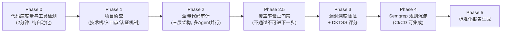
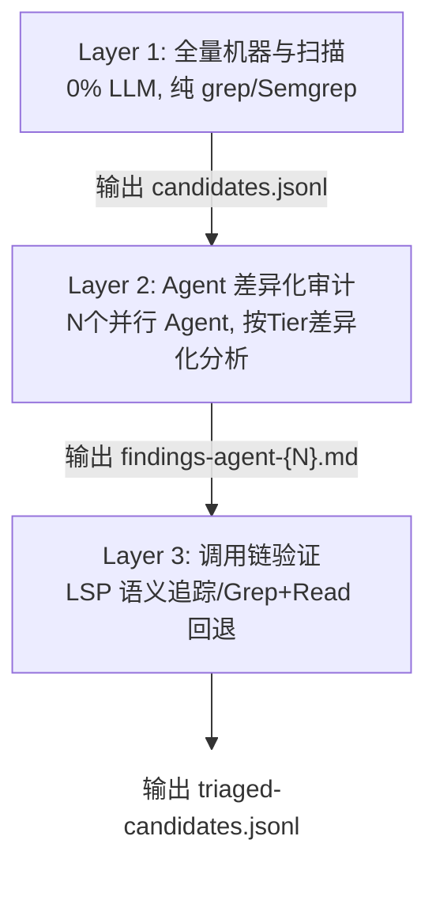

**问题的起点：LLM 做代码审计，到底行不行？**

  这个问题在安全圈已经争论了两年。乐观派说"AI 能看懂代码"，悲观派说"它连调用链都追不完整"。两边都对，但都没说到点子上。

  真正的问题不是 LLM 能不能审计代码——它当然能读懂代码、能识别危险模式、能推理数据流。问题在于：**它不知道该怎么系统地做这件事**。

  一个资深安全审计员拿到一个项目，脑子里有一套完整的工作流：先看架构、再摸攻击面、然后按优先级逐模块扫、发现可疑点追调用链、验证可利用性、最后出报告。这套流程是十几年实战经验的结晶，但 LLM 没有这个"骨架"。

  没有骨架的 LLM 做审计，就像一个天赋异禀但没受过训练的新手——看到什么审什么，想到哪写到哪，运气好能挖到几个洞，运气不好就在 Entity 类上浪费半天时间，最后交出一份充满幻觉的报告。

  所以答案是：**肯定行，但 LLM 有能力，缺纪律**。 而 Skill（技能协议）恰恰就是给它立规矩的东西。

  Skill 不是在教 LLM ”什么是 SQL 注入"——它早就知道了。Skill 做的是把一个资深审计员十几年的经验——不是知识，而是**工作方法和质量标准**——编码成 LLM 可以遵循的协议：定义工作流、分配资源、设置护栏、提供知识库、标准化输出。

  LLM 的知识面可能比任何单个审计员都广，但它缺少的是"怎么系统地用这些知识"。Skill 补上了这块短板。

具体差距有多大？下面先看裸跑 LLM 的实际表现，再看加载 Skill 后发生了什么变化。


**裸跑LLM vs Skil驱动：差的不是能力而是"章法"**


**裸跑LLM的典型表现**

  把一个 Java 项目丢给 Claude/GPT，说"帮我做安全审计"，你大概率会看到这样的过程：

  **随机游走式审计**：LLM 会先读几个看起来重要的文件，发现一个可疑点就深挖下去，挖完回来已经忘了之前看过什么。对于小项目（几千行）这没问题，但面对 10 万行以上的代码库，这种方式的覆盖率可能只有 10-20%。

  **幻觉问题**：LLM 可能会"编造"代码片段——它记得某个文件大概长什么样，但具体到行号和变量名就开始瞎编。审计报告中出现不存在的方法调用、错误的行号，这在安全审计中是致命的。

  **深度不均匀**：LLM 可能在一个 SQL 注入上花 20 分钟写出完美的分析，但完全忽略了旁边的认证绕过。没有优先级框架，它不知道什么该深挖、什么该快速过。

  **上下文丢失**：大型项目审计是个长时间任务，LLM 的上下文窗口是有限的，审计到后半段时，前面发现的架构信息、认证机制、依赖版本全忘了。

  **报告质量参差不齐**：有时候给你一个完美的 PoC，有时候连漏洞类型都标错。没有统一的输出标准，每次审计的报告格式都不一样。


**Skill驱动后的变化**

  上面这些问题，不是 LLM 能力不行，而是没人告诉它该怎么组织这些能力。Skill 本质上就是一份"审计协议"——它不替代 LLM 的能力，而是给 LLM 的能力装上骨架和肌肉。

  加载 Skill 前后，同一个 LLM 的表现是质的差异：

| **维度**     | **裸跑LLM**               | **Skill驱动**                   |
| ------------ | ------------------------- | ------------------------------- |
| 覆盖率       | 10-30%（取决于运气）      | 100%（门禁强制）                |
| 幻觉率       | 高（编造代码/行号）       | 低（反幻觉规则约束）            |
| 优先级       | 无（看到什么审什么）      | 有（T1→T2→T3 分层）             |
| 上下文管理   | 无（后期遗忘前期信息）    | 有（每 Phase 写文件持久化）     |
| 报告质量     | 不稳定                    | 6 核心块强制完整                |
| 可复现性     | 低（每次结果不同）        | 高（流程标准化）                |
| 大项目适应性 | 差（>50K LOC 就开始丢失） | 好（EALOC 动态分配 + 多 Agent） |

  表里这些指标不是凭空来的——每一项背后都有具体的设计机制在支撑。下面用一个实际的 Java 安全审计 Skill 来拆解，看看同样的 LLM 加载 Skill 后，到底是哪些策略带来了这些变化。


**一条完整的审计流水线长什么样**

  好的审计 Skill 不是一个大 prompt，而是一条严格的流水线。以下是一个经过实战验证的 6 阶段设计：



  LLM 不再需要"想"下一步该做什么，协议已经规定好了。每个 Phase 有明确的输入、输出和质量标准，Phase 之间通过文件系统传递状态——这是一个关键设计：不信任 LLM 的"记忆"，所有中间结果都持久化到文件，任何时候都可以重读恢复上下文。

各阶段简述：

- Phase 0（代码库度量）：纯自动化 Bash 脚本，统计项目规模（LOC、文件数、模块数、Controller 数量），计算复杂度评分，为后续 Agent 动态分配提供依据。这是工程度量层，不涉及漏洞发现逻辑。
- Phase 1-3（核心审计流程）：项目侦察 → 全量代码审计 → 覆盖率门禁 → 漏洞深度验证，这是整个 Skill 体系的核心能力点，下文将重点拆解。
- Phase 4（Semgrep 规则沉淀）：将确认的漏洞模式转换为 Semgrep 静态分析规则（YAML 格式），可集成到 CI/CD 流水线，实现漏洞模式的持续监控。这是审计后的产物沉淀，属于可选的后处理步骤。
- Phase 5（标准化报告生成）：使用预定义模板将 findings-verified.md 的数据格式化输出为完整审计报告（含 Executive Summary、漏洞详情、DKTSS 评分、修复建议等）。这是通用的格式化输出层。

  这条流水线解决了裸跑 LLM 的所有核心问题，下面逐个拆解 Phase 1-3 的关键设计。


**EALOC资源分配：不做无用功，把算力用在刀刃上-Phase 1**


**问题：大型项目里 70% 的代码不值得深挖**

  一个典型的 Java Web 项目，代码构成大概是这样的：Controller/Filter 占 10-15%，Service/DAO 占 20-30%，Entity/VO/DTO 占 50-70%。如果按代码行数平均分配审计资源，大量时间会浪费在 Entity 类上——这些类通常只有 getter/setter，安全风险极低。

  但你又不能直接跳过它们，Entity 里偶尔会藏着 Mass Assignment 风险（敏感字段未标注 `@JsonIgnore`）、密码字段可能被序列化输出，甚至有人在 Entity 里写业务逻辑。


**解法：Tier 分层+EALOC公式**

  先把文件分成三个 Tier：

| Tier               | 包含内容                                                     | 分析深度                                          | 权重 |
| ------------------ | ------------------------------------------------------------ | ------------------------------------------------- | ---- |
| T1 <br />攻击层面  | Controller,Filter,Interceptor,SecurityConfig,WebSocket Handler | 完整6点分析+端点枚举+绕过假设                     | 1.0  |
| T2<br />业务逻辑层 | Service,DAO,Repository,Mapper,Util,Helper,配置文件           | 聚集3点:数据流+危险操作+安全控制                  | 0.5  |
| T3<br />数据模型层 | Entity,VO,DTO,POJO                                           | 3项模式匹配:Mass Assignment+敏感数据暴露+隐藏逻辑 | 0.1  |

 然后用 EALOC（Effective Analysis LOC）公式计算实际审计工作量：

```
EALOC = T1_LOC × 1.0 + T2_LOC × 0.5 + T3_LOC × 0.1
```

  实际效果有多大？看一个真实案例：

```
某项目模块：131,000 LOC
├── T1 (Controller/Filter): 14,000 LOC → EALOC = 14,000
├── T2 (Service/DAO):       30,000 LOC → EALOC = 15,000
└── T3 (Entity/VO/DTO):     87,000 LOC → EALOC =  8,700
                                          ─────────────
                                    总 EALOC = 37,700
按 15,000 EALOC/Agent 预算：ceil(37,700 / 15,000) = 3 个 Agent
如果按原始 LOC 分配：ceil(131,000 / 15,000) = 9 个 Agent
```

  削减 67% 的 Agent 数量，但审计质量不降——因为那 87K 的 Entity 代码本来就不需要逐行深度分析，3 项模式匹配足够了。


**Tier 分类规则**

  分类不是拍脑袋，而是一套优先级递减的规则引擎：

```
Rule 0: 第三方库源码 → SKIP（不审计 Fastjson 源码，审计你怎么调用它）
Rule 1: Layer 1 预扫描有 P0/P1 候选项 → T1（动态提升）
Rule 2: 含 @Controller/@RestController/@WebServlet/Filter → T1
Rule 3: 含 @Service/@Repository/@Mapper → T2
Rule 4: 类名含 Util/Helper/Handler → T2
Rule 5: .properties/.yml/security.xml → T2
Rule 6: 含 @Entity/@Table/@Data → T3
Rule 7: 未匹配任何规则 → T2（保守兜底，不降级）
Rule 8: T3 文件有 P2/P3 候选项 → 保持 T3 但标记 review_flag
```

 Rule 1 的"动态提升"指的是：如果一个 Service 文件里出现了 `Runtime.exec()` 这种 P0 级危险模式，它会被自动提升到 T1 做完整分析，而不是按 T2 的简化流程处理。Rule 7 的"保守兜底"也值得注意——未匹配的文件默认 T2 而不是 T3，宁可多花时间也不降低分析深度。


**三层审计架构：机器扫广度，AI挖深度，语义追链条-Phase 2**

  Phase 2 的核心是一个三层架构，每层解决不同的问题：



**Layer 1：不用LLM 的全量预扫描**

  **Layer 1 完全不用 LLM**

  它用 ripgrep + Semgrep 扫描所有 `.java`/`.kt`/`.xml` 文件，按 P0-P3 四个优先级标记危险模式。

  扫描规则的设计直接决定了预扫描的质量，以 P0-RCE（远程代码执行）为例，不只是扫 `Runtime.exec`，而是覆盖整个攻击面：

```
# 反序列化全家族
grep -rn "ObjectInputStream\|XMLDecoder\|XStream" --include="*.java"
grep -rn "JSON\.parseObject\|JSON\.parse\|@type" --include="*.java"  # Fastjson
grep -rn "enableDefaultTyping\|activateDefaultTyping" --include="*.java"  # Jackson
grep -rn "HessianInput\|Hessian2Input" --include="*.java"  # Hessian
 
# SSTI 全引擎
grep -rn "Velocity\.evaluate\|VelocityEngine\|mergeTemplate" --include="*.java"
grep -rn "freemarker\.template\|Template\.process\|FreeMarkerConfigurer" --include="*.java"
grep -rn "SpringTemplateEngine\|TemplateEngine\.process" --include="*.java"  # Thymeleaf
 
# 表达式注入
grep -rn "SpelExpressionParser\|parseExpression\|evaluateExpression" --include="*.java"
grep -rn "OgnlUtil\|Ognl\.getValue\|ActionContext" --include="*.java"
 
# JNDI 注入
grep -rn "InitialContext\.lookup\|JdbcRowSetImpl\|setDataSourceName" --include="*.java"
```

  每个扫描规则都同时匹配 `javax.*` 和 `jakarta.*` 变体——这是 Java 生态从 Java EE 迁移到 Jakarta EE 的历史遗留，很多通用工具会漏掉其中一个命名空间。

  排噪规则也很关键：排除 test 目录、排除注释行、排除 import 语句、每个匹配携带 ±3 行上下文。

  注意：Layer 1 的输出是 Layer 2 Agent 的"辅助参考"，不是"唯一入口"。Agent 不能只看 Layer 1 标记的文件——它必须逐文件阅读所有分配给它的代码。Layer 1 的价值只是告诉 Agent"这个文件里有已知危险模式，优先验证"，但 Agent 自己的代码阅读才是发现漏洞的主通道，这主要是为了避免只看工具标记的文件，而遗漏工具无法识别的逻辑漏洞。


**Layer 2：双轨审计模型**

  **Layer 2 是 LLM 真正发挥作用的地方**

  每个 Agent 都会对分配给它的文件执行两条并行的审计轨道：

1. Sink-driven（从危险代码往上追）：发现 `Runtime.exec(cmd)` → 追踪 `cmd参数` 从哪来 → 是否有过滤或检测 → 最终判断其是否来自用户输入。这条轨道的主要作用就是发现代码中"危险代码的存在"。
2. Control-driven（从端点往下查安全控制是否缺失）：发现 `/api/admin/deleteUser` 端点 → 检查是否有认证注解 → 检查是否有权限校验 。这条轨道的主要作用就是发现代码中"安全控制的缺失"。

  为什么需要两条轨道？因为认证绕过这类漏洞，单独用 Sink-driven 是找不到的——该漏洞不是某行代码有问题，而是某个端点缺少了应有的权限检查并且就算挖掘到漏洞了也需要对漏洞进行权限条件等判断，因此Control-driven不可或缺且只有 Control-driven 才能发现"该有的东西没有"。

  双轨模型解决了"发现什么"的问题，但还有一个问题：每个文件该挖多深？这就回到了上文定义的 Tier 分层。Layer 2 的 Agent 拿到文件后，会根据 Tier分层 的结果(可以使其落地成一个文件)对每个文件执行不同深度的分析。这是一种按需分析、按层分级的思路，也是代审人员常根据代码架构进行审计的思路：

- T1 文件（Controller、Filter、Interceptor、SecurityConfig 等攻击面入口）—— 这是外部请求进入系统的第一站，也是攻击者最先接触到的代码。需要完整的深度分析。

- T2 文件（Service、DAO、Mapper、Util、配置文件等业务逻辑层）—— 处理业务数据和持久化操作的中间层，可能封装了危险操作或缺少安全校验，但不直接暴露给外部。聚焦关键维度即可。

- T3 文件（Entity、VO、DTO、POJO 等数据模型层）—— 大部分是 getter/setter，但偶尔藏着 Mass Assignment 风险或敏感字段暴露。快速模式匹配足够。

  **例如 T1 文件可以分 6 点分析：**

  数据流：外部输入如何流入危险操作

  安全控制：认证/授权/输入验证/输出编码是否存在且有效

  敏感操作：文件操作/网络请求/加密/序列化/反射/动态代理

  自定义封装：工具类是否包装了危险操作

  配置与初始化：安全相关配置是否正确

  业务逻辑：权限检查/状态机/竞态条件/数据校验

  \+ 端点枚举：列出所有对外接口及参数

  \+ 绕过假设：对发现的安全控制穷尽绕过可能性

  T2 文件只做其中 3 点（数据流 + 危险操作 + 安全控制）

  T3 文件只做 3 项模式匹配。

  但如果 T2 文件里发现了封装危险操作的方法，就地提升到 T1 级分析；T3 文件里发现了非 getter/setter 的业务方法，动态提升到 T2。


**Layer 3：调用链的语义级验证**

  **Layer 2 发现的候选漏洞需要验证 Source → Sink 的可达性**

  这一层优先使用 LSP做语义级追踪：

```
候选 Sink（如 Statement.executeUpdate(sql)）
    ↓ goToDefinition → 确认 Sink 方法的实际实现（是直接执行还是安全封装？）
    ↓ findReferences → 向上追踪所有调用者
    ↓ hover → 获取中间变量类型（是 String 还是 SafeString？有没有隐式 Sanitizer？）
    ↓ 重复 findReferences → 直到到达 Controller 入口（Source）或确认不可达
    ↓
记录完整调用链，每一跳标注 文件:行号
```

  LSP 不可用时退化到 Grep + Read 手动追踪但是精度自然就会下降，但是能保证流程不中断。

**LSP不可用场景：**

1、非常规手段获取的代码由于其结构混乱无法反编译成功

2、压根就没装或不可装LSP

**小结**

上篇我们拆解了AI代码审计Skill体系的流水线设计与资源分配机制：

  问题本质：LLM不缺能力，缺的是"工作方法和质量标准"——Skill就是给它装上资深审计员的工作骨架。

  核心机制：

- 6阶段流水线：从代码度量到标准化报告，每个Phase有明确输入输出，中间结果全量持久化
- EALOC资源分配：Tier分层（T1/T2/T3）+ EALOC公式，削减**67%** Agent成本但不降质量
- 三层审计架构：机器扫广度（Layer 1）+ AI挖深度（Layer 2双轨模型）+ 语义追链条（Layer 3）

  这些设计解决了"如何高效审计"的问题——让AI从随机游走变成系统化作战。但光有流水线还不够，还需要质量保障机制：如何确保100%覆盖不遗漏、如何约束LLM的幻觉、如何精准判断漏洞成立条件、如何给漏洞评定实战优先级——这些将在下篇深入展开。


